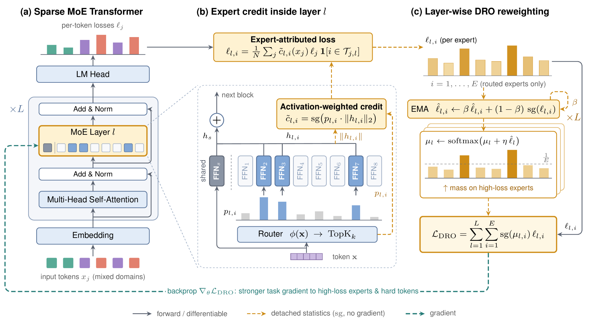

<h1 align="center">Distributionally Robust Mixture-of-Experts Training</h1>

<p align="center">
  <a href="https://arxiv.org/abs/2610.07207"></a>
  <a href="https://drmoet.github.io/"></a>
  <a href="https://huggingface.co/TonyTeng/DRMoET"></a>
</p>

<p align="center">
  <a href="https://xinteng.ai/">Xin Teng</a>, Muxiao Li, <a href="https://whongyi.github.io/">Hongyi Wen</a><br>
  New York University<br>
  Center for Data Science, NYU Shanghai
</p>

<p align="center"><strong>Accepted at NeurIPS 2026</strong></p>

<p align="center">
  
</p>

## Overview

This repository contains the training and analysis code for **DRMoET**, which applies distributionally robust optimization (DRO) over experts during MoE pretraining. For every MoE layer, a distribution μ over experts is shifted online toward experts with higher (EMA-smoothed) loss, and the training objective weights each expert's loss by μ, so lagging experts receive more training signal.

We study two ways to credit the loss of each token to its experts:

| Variant | Credit assigned to expert *e* for token *t* | Entry point |
|---|---|---|
| **Probability credit** | router probability p<sub>t,e</sub> of the selected experts | `Megatron-LM/pretrain_gpt_dro.py` |
| **Activation credit** | norm of the expert's output ‖E<sub>e</sub>(x<sub>t</sub>)‖ | `Megatron-LM/pretrain_gpt_dro_activation.py` |

We compare against the [FLAME-MoE](https://github.com/cmu-flame/FLAME-MoE) baseline (auxiliary load-balancing loss) and an **auxiliary-loss-free** baseline (expert-bias load balancing).

The code is built on [FLAME-MoE](https://arxiv.org/abs/2505.20225) and [Megatron-LM](https://github.com/NVIDIA/Megatron-LM).

## Setup

Clone with submodules (our Megatron-LM fork, TransformerEngine, apex, and lm-evaluation-harness):

```bash
git clone --recursive https://github.com/MAPS-research/DRMoET.git
cd DRMoET
```

All scripts are run **from the repository root** and read site settings (paths, conda env, W&B entity) from [`scripts/config.sh`](scripts/config.sh). Edit the defaults there or export the variables before launching.

Create the environment (PyTorch 2.6 / CUDA 12.4, Python 3.10):

```bash
bash scripts/miscellaneous/install.sh      # or: sbatch scripts/miscellaneous/install.sh
```

## Data

We pretrain on DCLM, tokenized with the Pythia tokenizer (`EleutherAI/pythia-12b`). The tokenized Megatron `.bin/.idx` shards are expected under `$SSD_DATASET/tokenized/EleutherAI/pythia-12b`.

```bash
sbatch scripts/dataset/download_local.slurm
sbatch scripts/dataset/tokenize_local.slurm
```

These two jobs run inside a Singularity container; set `SINGULARITY_IMAGE` and `SINGULARITY_OVERLAY` in `scripts/config.sh`.

## Training

Each recipe in [`scripts/release/`](scripts/release) sets the model size and method hyperparameters, then submits a SLURM job. Checkpoints go to `$SSD_WEIGHTS/<MODEL_SIZE_ID>`.

| Method | 290M | 1.7B | Other sizes |
|---|---|---|---|
| FLAME-MoE baseline | `flame-moe-290m.sh` | `flame-moe-1.7b.sh` (+ `-seed7`, `-seed42`) | `38m`, `98m`, `115m`, `419m`, `721m` |
| Aux-loss-free | `flame-moe-290m-aux-loss-free.sh` | `flame-moe-1.7b-aux-loss-free.sh` | |
| DRMoET, probability credit | `flame-moe-290m-dro.sh` | | `38m-dro`, `98m-dro` |
| DRMoET, activation credit | `flame-moe-290m-dro-activation.sh` | `flame-moe-1.7b-dro-activation.sh` | `98m-dro-activation` |

```bash
bash scripts/release/flame-moe-290m-dro-activation.sh
```

To run a recipe on a single machine without SLURM:

```bash
bash scripts/run_local.sh scripts/release/flame-moe-290m-dro-activation.sh
```

The DRO hyperparameters are set in the recipe:

| Variable | Flag | Meaning |
|---|---|---|
| `DRO_BETA` | `--dro-beta` | EMA decay for per-expert loss estimates |
| `DRO_ETA` | `--dro-eta` | base step size η₀ of the μ update (η = η₀ / √E) |
| `DRO_ALPHA` | `--dro-alpha` | power-mean exponent of the DRO loss; `1.0` (used in all recipes) is the μ-weighted mean |
| `DRO_ACTIVATION_NORM_TYPE` | `--dro-activation-norm-type` | `l2`, `l1`, or `mean` (activation credit only) |

`flame-moe-290m-dro-activation-sweep.sh` sweeps `DRO_ETA`.

## Evaluation

Downstream evaluation (0- and 10-shot OpenBookQA, WinoGrande, PIQA, ARC-e/c, HellaSwag) via lm-evaluation-harness:

```bash
MODEL_SIZE_ID=290m ITER=16000 sbatch scripts/evaluate_local.slurm
# every saved checkpoint of a run:
MODEL_SIZE_ID=290m sbatch scripts/evaluate_all_checkpoints.slurm
```

## Analysis

- `scripts/analysis/`: routing and expert probes (routing boundary, oracle expert, per-field / per-window perplexity, misrouting, domain probes).
- `scripts/empirical_analysis/`: expert utilization, co-activation, router saturation, and specialization (capture routing traces, then plot with the notebooks).
- `analysis/`: scaling-law fitting and plotting.

## Repository layout

```
configs/            model and training hyperparameters (sourced by the launchers)
scripts/release/    one recipe per experiment
scripts/training/   SLURM launchers and per-node training modules
scripts/dataset/    download and tokenization
scripts/analysis/   probes and evaluation utilities
Megatron-LM/        our fork (DRO entry points and MoE logging)
```

## Citation

```bibtex
@inproceedings{teng2026drmoet,
  title     = {Distributionally Robust Mixture-of-Experts Training},
  author    = {Teng, Xin and Li, Muxiao and Wen, Hongyi},
  booktitle = {Advances in Neural Information Processing Systems},
  year      = {2026}
}
```

## License

The code in this repository is released under the [MIT License](LICENSE). Submodules (Megatron-LM, TransformerEngine, apex, lm-evaluation-harness) keep their own licenses.
